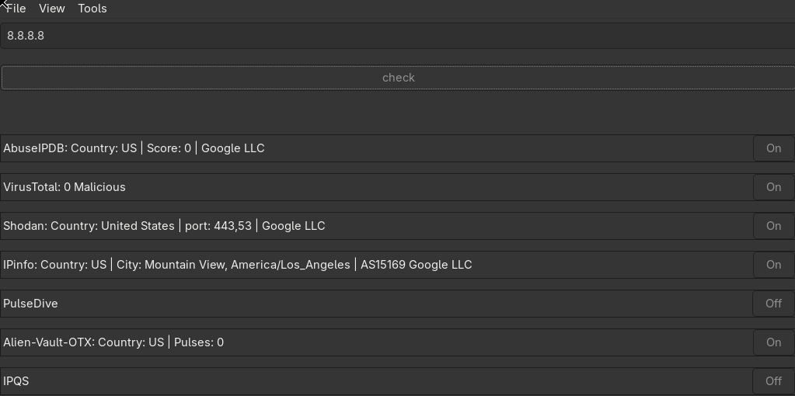
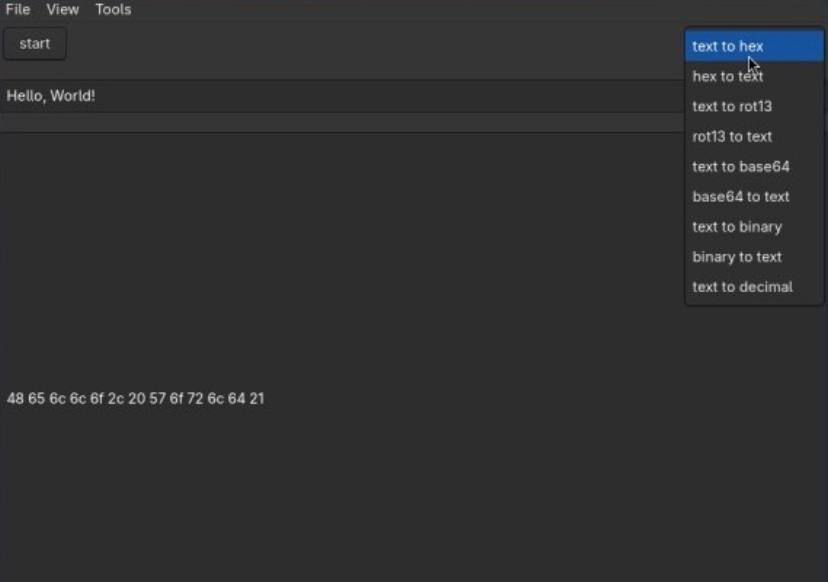
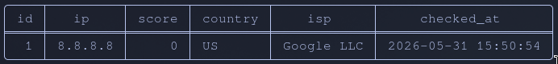
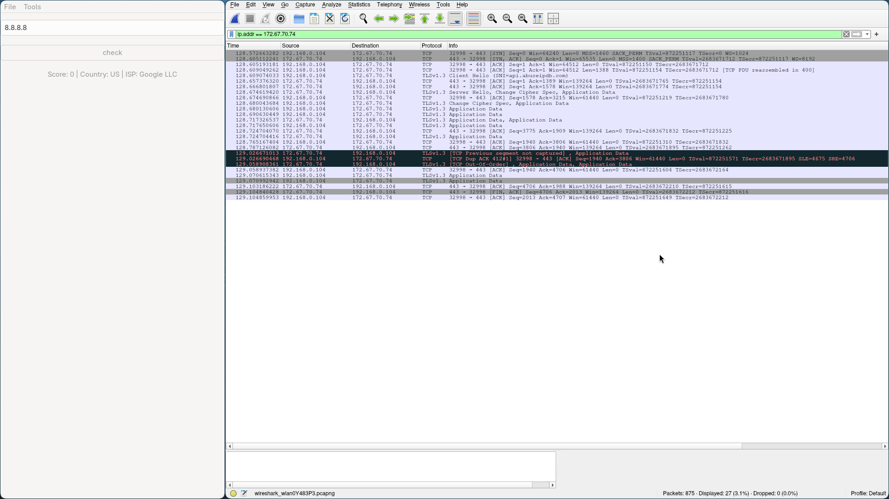

# Threat Intel 

GUI	app for checking IP reputation via **7 threat intelligence APIs**.
Results cached locally in SQLite.

# Why I built this

While analyzing network traffic in Wireshark, I kept juggling 
AbuseIPDB, Shodan, VirusTotal and 4 other tabs simultaneously — 
manually correlating results for every suspicious IP.
Built this to consolidate all of them into one lookup. SQLite caching 
means repeated IPs don't burn through API rate limits.

## Screenshots

### GUI


### DECODE/ENCODE



### SQL


### Network (Wireshark)


## Stack

<div align="center">


</div>

## Features

- IP reputation check via 7 APIs simultaneously (multithreaded)
- Results cached in SQLite (no duplicate requests)
- Encode/Decode tool (hex, base64, binary, rot13)
- Dark/white theme with persistence
- Per-checker toggle (enable/disable APIs)
- Docker support

## Dependencies

**Arch Linux:**
```sh
sudo pacman -S gtk3 curl cjson sqlite cmake pkgconf
```

**Ubuntu/Debian:**
```sh
sudo apt install libgtk-3-dev libcurl4-openssl-dev libcjson-dev libsqlite3-dev cmake pkg-config
```

## Build & Run

```sh
git clone https://github.com/yorjjeartemitt/threat-intel.git
cd threat-intel
cp .env.example .env   # add your API key
mkdir -p build
./run gcc     # build with gcc and run
./run cmake   # build with cmake and run
./run docker  # run in docker
./run sql     # view saved results
```

---

## API Keys

You need to register and get free API keys for each service.
Add them to your `.env` file (see `.env.example`).

| Service | Register |
|---|---|
| AbuseIPDB | [link](https://www.abuseipdb.com) |
| VirusTotal | [link](https://www.virustotal.com) |
| Shodan | [link](https://shodan.io) |
| IPinfo | [link](https://ipinfo.io) |
| PulseDive | [link](https://pulsedive.com) |
| AlienVault OTX | [link](https://otx.alienvault.com) |
| IPQS | [link](https://www.ipqualityscore.com) |
